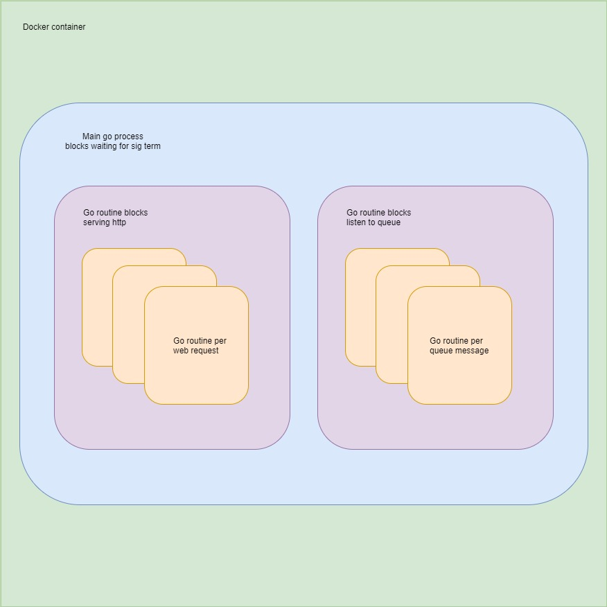

# go-example-app

An example multi-purpose go microservice

## Motivation

I think I need a bit of a break from dynamically typed scripting langauges. I've enjoyed playing with go quite a bit and it appears to fit well as a tool in the world of distributed systems programming that I appear to be in the thick of right now. It offers a great api for concurrent programming and decent static typing without being object oriented. Plus it has a great mascot :)

## Goal

Investigate implementation of multiple features that would be required of a production grade microservice while leveraging golangs strong concurrency api

## Requirements

- [x] Receive http requests 
- [x] Receive work from a queue
- [ ] Persistent storage of some kind
- [X] Caching mechanism
- [x] Dockerized
- [ ] Environmentaly configurable
- [ ] Produce structured log output
- [ ] Dependancy injection
- [ ] Unit and integration test configuration
- [ ] CI/CD configuration

## Diagram

## License
[MIT](https://choosealicense.com/licenses/mit/)